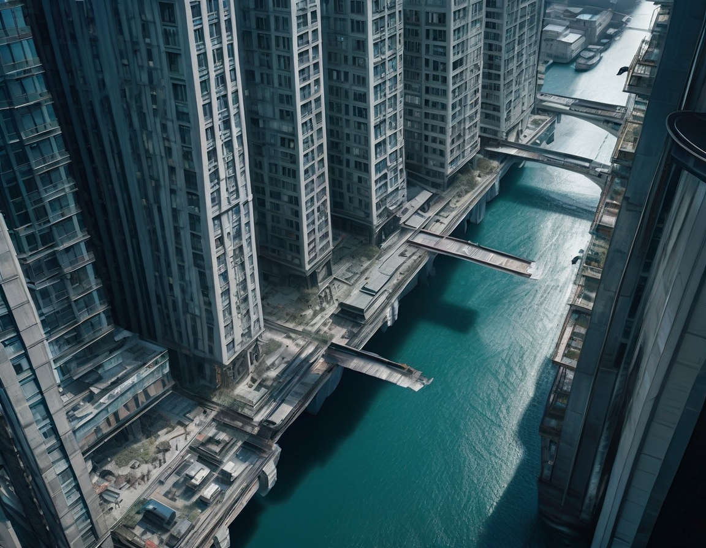

# Chapter 1

*Seems like the crops aren't as bountiful as normal*, I thought to myself while examining a rotten carrot.
Rummaging through the crate I could find a couple small healthy ones.
Putting them into my bag I move towards the next crate with shiny red-green tomatoes. 
I grabbed a few more with a tight squeeze to ensure they aren't rotten and add it to my bag.
*These should be enough for the week.*

"How much do I owe you?" I say as I place down my bag of vegetables and start reaching for my pocket of coins.
The merchant stares at me blankly.
*Shit, I crossed the border 3 days ago, no wonder he's looking at me like an alien.*
I reach for the base of my neck right above my left collarbone and press on the metal rectangle slightly protruding from the silicon circle implanted in my neck.
Pulling at the metal rectangle from my neck I retrieve my SkillShard and place it on the counter while I fumble for another in my pocket.
The merchant looks at it curiously and points to the reflective glass surface of the SkillShard and starts asking me about it.
Well at least that's what I presume, I have no clue what this guy is saying.
I grab the cloth in my pocket and unwrap it to reveal another SkillShard that looks identical to the one laying on the counter.
As I insert it, I feel a slight headache, as if theres some force pressing my brain upwards through my skull.
Everything goes hazy for a second, but I recover my balance and find my headache to be gone.
*Damn learning pains.*

"How much do I owe you?" I ask again.

"You're a Modo!" the merchant says.

I laugh while picking up my old SkillShard from the counter and etching an 'I' into the metal backplate.
"And you're a Pure, now that we got that out of the way how much do I owe you?"

The merchant starts reaching under the counter with a shocked look on his face.
*A gun? No can't be, they destroyed the last of those over 30 years ago.
Although it isn't impossible to fashion one in this wasteland.
He must be pulling some weapon out however.*
I glance around the market, theres only 3 other people in the vicinity, two of which are other shop owners busy on their Glasses.
*I should pull out my knife, duck under this table and slice his ankles, bringing him down to an advantageable position.
The next stab would be to his voicebox, disable any screaming opportunities.
I can worry about the blood on my hands later.*

I start reaching to my back and sliding my knife still behind the cover of my coat.
The merchant quickly pulls out and sets down a wooden box on the table.
Startled with his speed I accidentally flash my knife and start sheathing it again.
*Damn Sharder, who the hell loaded combat experience on this thing.*

"I traded these SkillShards from a traveler years ago, but I haven't met anyone else since who is a Modo. Are you interested in any of these?"
The merchant opens the box and shows 7 neatly stacked glass prisms.
These shards were different though, the metal backplates had a monogrammed 'M' at the base of them.
A thin purple filament was also in the shard, running from the metal backplate to the metal contacts at the front of the shard.

"These aren't SkillShards."

"What do you mean? This is identical to what you had just a second ago!"

"These are MemShards. They don't upload skills they upload memories and experiences."

"So? Isn't that better?"

"They're dangerous, you don't know what memories could be on them. Could be kicking back sipping juice on an Australian beach. Could be having your lungs ripped out while you are hopped on adrenaline and strapped to a gurney."

"But they're just shards? Just unplug it if it starts getting bad."

"Its hard for a Pure to understand. When you upload a MemShard, you live the entire memory whether you like it or not."

"But wouldn't that take forever?"

"Think about when you bought these shards, deeply think about them. You remember the entire experience in a couple seconds right?"

"Faster."

"Exactly. Brains can parse the memory much faster than time takes to create them."

"So if its only for a second, then even the bad ones can be ignored quickly."

"Memories invoke primitive reactions in the brain. Some of these reactions can dump chemicals[^1] into the body, causing paralysis and death. It's not worth injecting a MemShard unless you created it."

"So... I've been scammed."

"Afraid so. Look how much do I owe you for the vegetables."

"80 units."

"80? This is outrageous, I will give you 60 units."

"70 units and I throw in these MemShards."

"I don't want the shards, I will give you 65."

"You can leave bag here I will put the stuff back."

"Fine. 70."
I reach into my pocket and take out three hexagonal coins, one significantly larger than the other two and place it on the table.
The merchant smiles and puts the box of MemShards in my bag.

"I told you I don't want these."

"I do not know what to do with these, and I certainly don't want to sell these 'Death Sticks' to anyone I know."

"I'm flattered that you'd sell them to me then."

"No, I just know you will know what to do with them better than I do."

I take my bag and leave. I start walking out of the market, situated deep underground inside an abandoned hypertube tunnel.
Stepping up to the surface, I take a deep breath of the cold air, thick with the smell of concrete dust, sea salt, and some smoke.
Its an eveloping cold, immediately grabbing you in its icy paws and pressing its frozen fingers up your nose.
Finally making to the top of the staircase, its like the invisible barrier that was keeping all the heat from the underground broke, allowing me to go to the colder surface. 

I start walking towards a bridge, the last one that was built back in 2083.
This bridge was supposedly the final act local government did to prohibit people from moving their megayachts from the sea to the internal pier, and messing up the wildlife along the way.
Lots of protestation towards this, since the rich only cared about how fast they can take their trillion unit megayachts and how much faster it was compared to the others. They couldn't care less about the marine population that would get caught in the wake, slamming into the nearest rock and dying. They wouldn't care about the sensitive acidic climate the coral just off the coast is, and that the megayachts would dump oil due to profit maximization and poor build quality.

And they didn't care less about the bridge, when just 5 years after the finished bridge the first megahoveryachts came to market.
After that, it wasn't the marine animals in danger, it was the avian and even humans.
Drunk pricks would disable autopilot and drive their yachts in hover mode out of the harbor and slam into buildings along the way.
One yacht didn't even look like he tried to make it out to the sea, he crashed straight into a neighboring bridge during rush hour, killing everyone on the yacht and drowning everyone on the bridge.

*Where the hell did the Sharder get this shard from? Am I supposed to believe it just so happened to come bundled with the knowledge of this exact city, where ever the hell I am?*

Looking back at the city from the apex of the bridge, I see the desolate architecture that was once heavily populated.
Tall glass buildings fill the skyline, with a single waterway cutting between two sides leading out to the ocean.
All the neon lights and tubes on the sides of the buildings were gray, they haven't operated for years.
The sky seemed to blend in with the city entirely as well, with all the clouds blocking the sun from reaching this area.
The city looked lifeless, without hope and desolate.

I continue my trek all the way to the hostel house on the collapsed pier.
The house was seemingly the only building in the entire city made of wood.
*Probably used to be a watchguard's house or something.*
This wood hasn't stood the test of time however, with numerous cracks, mold, and other debris plaguing the structure.
The only windows in the front were boarded shut, presumably to keep the cold out.
The house was small, only two bedrooms upstairs, and a kitchen, living room, and office room downstairs.
Despite its rustic look, it seems that the previous owners took great care to ensure its up to date, with holographic TVs with satellite shows,
plasma stoves, and full electricity hookup.
Two other men welcomed me back as I set down my bag on a chair nearby.

"Hey! Conan!" exclaimed the heavy one, happy to see me, but not happy enough to stand up out of his recliner.

"No its Gonner you dip!" yelled the thin one, wheeling himself towards the other.

"No its Conan he told me himself!" the heavy one exclaimed and crossed his hands while looking away.

As the two prattled over my name I took off my hat and hung it on a hook near me and took my groceries to the kitchen.

Thirty minutes later, while the other two sat still arguing, I searched the kitchen for some utensils.
After only finding a spoon, I just took the pot with me and walked back into the living room.

"What's your name?" The heavy one asked me.

"Its Gonan." *Its better for them to not know, or at least its better for me.* I thought to myself.

"See! Told you!" the heavy one pointed at the thin one. *Here they go again.*

I excused myself to the office room, which to be honest is a misnomer. The room used to be an office, with a desk in the middle of the room, facing a big window with a view of the end of the collapsed pier and the ocean. Behind the desk, there were shelves of books. Now, the room has been extended, with the desk still in its place, except there is a planterbox where the window stood, filled with white daisies.

The first time I saw this I was astounded, and confused. *Who was watering these daisies? How have they survived for so long?*
But now, I just accept that this exists, much like I have been doing with other things in my life.
Just accepting.

[^1] If you know of any specific examples, please let me know!
